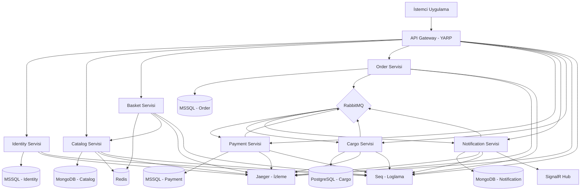

# ShopVerse — E-Ticaret Mikroservis Platformu

**.NET 8** mikroservis mimarisi ile geliştirilmiş bulut-tabanlı bir e-ticaret platformudur. Her domain bağımsız olarak dağıtılabilir, **RabbitMQ** (MassTransit) üzerinden asenkron iletişim kurar ve **OpenTelemetry** dağıtık izleme ile **Jaeger** üzerinden gözlemlenebilir.

---

## Mimari



---

## Teknoloji Yığını

| Katman | Teknoloji |
|---|---|
| Runtime | .NET 8, C# 12 |
| API Gateway | YARP Reverse Proxy |
| REST API | ASP.NET Core Web API |
| gRPC | Grpc.AspNetCore (Catalog) |
| Gerçek Zamanlı | SignalR (Notification) |
| Mesaj Broker | RabbitMQ + MassTransit (Saga, Outbox) |
| ORM / Veri Erişimi | EF Core (Identity, Order, Payment), Dapper (Cargo), MongoDB Driver (Catalog, Notification) |
| Önbellekleme | Redis (StackExchange.Redis) |
| Kimlik Doğrulama | JWT Bearer, ASP.NET Core Identity |
| Doğrulama | FluentValidation |
| CQRS / Mediator | MediatR |
| Loglama | Serilog + Seq |
| Dağıtık İzleme | OpenTelemetry v1.16 + Jaeger (OTLP gRPC) |
| Hata Yanıtları | RFC 7807 ProblemDetails |
| API Dokümantasyonu | Swashbuckle (Swagger/OpenAPI) |
| Konteynerizasyon | Docker, docker-compose |
| CI/CD | GitHub Actions |

---

## Servisler

| Servis | Port | Veritabanı | Sorumluluk |
|---|---|---|---|
| **Gateway** | 5000 | — | API yönlendirme (YARP), JWT doğrulama, rate limiting, CORS, Swagger birleştirme |
| **Identity** | 5001 | MSSQL | Kullanıcı kaydı, giriş, JWT üretimi, refresh token, şifre değiştirme |
| **Catalog** | 5002 | MongoDB + Redis | Ürün ve kategori CRUD, Basket için gRPC endpoint, Redis önbellekleme |
| **Basket** | 5003 | Redis | Alışveriş sepeti yönetimi, ürün doğrulama için Catalog'a gRPC çağrıları |
| **Order** | 5004 | MSSQL | Sipariş oluşturma, MassTransit Saga orkestrasyonu (Order → Payment → Cargo), Outbox pattern |
| **Payment** | 5005 | MSSQL | Ödeme işleme, süresi dolmuş ödemeler için Hangfire recurring job |
| **Notification** | 5006 | MongoDB | SignalR ile gerçek zamanlı bildirimler, tüm domain event'leri tüketir |
| **Cargo** | 5007 | PostgreSQL | Kargo takibi, takip numarası üretimi, durum güncellemeleri (Admin) |

---

## Ön Koşullar

- [.NET 8 SDK](https://dotnet.microsoft.com/download/dotnet/8.0)
- [Docker Desktop](https://www.docker.com/products/docker-desktop/)
- (İsteğe bağlı) Visual Studio 2022 / VS Code / JetBrains Rider

---

## Hızlı Başlangıç

### 1. Projeyi klonlayın

```bash
git clone https://github.com/your-org/ShopVerse-Ecommerce-Microservice.git
cd ShopVerse-Ecommerce-Microservice/ShopVerse
```

### 2. Tüm servisleri Docker Compose ile başlatın

```bash
docker-compose up --build
```

Bu komut 8 mikroservisin tamamını ve altyapı servislerini (MSSQL, PostgreSQL, MongoDB, Redis, RabbitMQ, Seq, Jaeger) başlatır.

### 3. Servislere erişim

| Kaynak | URL |
|---|---|
| **API Gateway** | `http://localhost:5000` |
| **Swagger UI** (birleştirilmiş) | `http://localhost:5000/swagger` |
| **Jaeger UI** (dağıtık izleme) | `http://localhost:16686` |
| **Seq UI** (loglama) | `http://localhost:8081` |
| **RabbitMQ Yönetim Paneli** | `http://localhost:15672` (guest / guest) |

---

## API Endpoint'leri

Tüm endpoint'ler `http://localhost:5000` adresindeki **API Gateway** üzerinden `/api/v1/` ön eki ile yönlendirilir.

### Identity

| Metod | Endpoint | Yetki | Açıklama |
|---|---|---|---|
| POST | `/api/v1/auth/register` | — | Yeni kullanıcı kaydı |
| POST | `/api/v1/auth/login` | — | Giriş yapar, JWT döner |
| POST | `/api/v1/auth/refresh-token` | — | JWT token yenileme |
| GET | `/api/v1/auth/me` | Bearer | Mevcut kullanıcı bilgisi |
| POST | `/api/v1/auth/change-password` | Bearer | Şifre değiştirme |

### Catalog

| Metod | Endpoint | Yetki | Açıklama |
|---|---|---|---|
| GET | `/api/v1/products` | — | Ürünleri listele (sayfalanmış, filtrelenebilir) |
| GET | `/api/v1/products/{id}` | — | ID'ye göre ürün getir |
| POST | `/api/v1/products` | — | Ürün oluştur |
| PUT | `/api/v1/products/{id}` | — | Ürün güncelle |
| DELETE | `/api/v1/products/{id}` | — | Ürün sil |
| GET | `/api/v1/categories` | — | Tüm kategorileri listele |
| POST | `/api/v1/categories` | — | Kategori oluştur |

### Basket

| Metod | Endpoint | Yetki | Açıklama |
|---|---|---|---|
| GET | `/api/v1/basket` | Bearer | Mevcut kullanıcının sepetini getir |
| POST | `/api/v1/basket` | Bearer | Sepete ürün ekle |
| DELETE | `/api/v1/basket` | Bearer | Sepeti temizle |

### Order

| Metod | Endpoint | Yetki | Açıklama |
|---|---|---|---|
| POST | `/api/v1/orders` | Bearer | Yeni sipariş oluştur |
| GET | `/api/v1/orders/{id}` | Bearer | ID'ye göre sipariş getir |
| GET | `/api/v1/orders/my-orders` | Bearer | Mevcut kullanıcının siparişleri |
| POST | `/api/v1/orders/{id}/cancel` | Bearer | Siparişi iptal et |

### Payment

| Metod | Endpoint | Yetki | Açıklama |
|---|---|---|---|
| GET | `/api/v1/payment` | — | Tüm ödemeleri listele |
| GET | `/api/v1/payment/{id}` | — | ID'ye göre ödeme getir |
| GET | `/api/v1/payment/order/{orderId}` | — | Sipariş ID'ye göre ödeme getir |

### Notification

| Metod | Endpoint | Yetki | Açıklama |
|---|---|---|---|
| GET | `/api/v1/notification` | Bearer | Mevcut kullanıcının bildirimleri |
| PUT | `/api/v1/notification/{id}/read` | Bearer | Bildirimi okundu olarak işaretle |
| WS | `/hubs/notification` | Bearer (query) | SignalR gerçek zamanlı hub |

### Cargo

| Metod | Endpoint | Yetki | Açıklama |
|---|---|---|---|
| GET | `/api/v1/cargo/{trackingNumber}` | Bearer | Takip numarasına göre kargo getir |
| GET | `/api/v1/cargo/order/{orderId}` | Bearer | Sipariş ID'ye göre kargo getir |
| PUT | `/api/v1/cargo/{id}/status` | Admin | Kargo durumunu güncelle |

---

## Olay Akışı (Saga Orkestrasyonu)

```
Sipariş Oluşturuldu
  --> [MassTransit Saga] OrderStateMachine
    --> Yayınla: CreatePaymentMessage --> Payment Servisi ödemeyi işler
    --> Yayınla: PaymentCompletedEvent --> Saga ilerler
    --> Yayınla: CreateShipmentMessage --> Cargo Servisi kargo kaydı oluşturur
    --> Yayınla: CargoStatusUpdatedEvent --> Notification Servisi (SignalR push)
```

---

## Proje Yapısı

```
ShopVerse/
├── src/
│   ├── ApiGateway/ShopVerse.Gateway/        # YARP reverse proxy
│   ├── Services/
│   │   ├── Identity/                         # Kimlik doğrulama ve kullanıcı yönetimi
│   │   │   ├── ShopVerse.Identity.API/
│   │   │   ├── ShopVerse.Identity.Application/
│   │   │   ├── ShopVerse.Identity.Domain/
│   │   │   └── ShopVerse.Identity.Infrastructure/
│   │   ├── Catalog/                          # Ürünler ve kategoriler
│   │   ├── Basket/                           # Alışveriş sepeti
│   │   ├── Order/                            # Sipariş yönetimi + Saga
│   │   ├── Payment/                          # Ödeme işleme
│   │   ├── Notification/                     # Bildirimler + SignalR
│   │   └── Cargo/                            # Kargo takibi
│   └── Shared/
│       ├── ShopVerse.Shared.Core/            # BaseEntity, Result<T>, middleware
│       ├── ShopVerse.Shared.Logging/         # Serilog yapılandırması
│       ├── ShopVerse.Shared.Messaging/       # Domain event'leri, MassTransit mesajları
│       └── ShopVerse.Shared.Observability/   # OpenTelemetry yapılandırması
├── tests/
├── docker-compose.yml
├── docker-compose.override.yml
└── ShopVerse.sln
```

Her servis **Clean Architecture** prensiplerini takip eder: Domain → Application → Infrastructure → API.

---

## Gözlemlenebilirlik

### Dağıtık İzleme (Jaeger)

Tüm servisler **OpenTelemetry v1.16** ile enstrümante edilmiştir:
- ASP.NET Core HTTP istek izleme
- HTTP Client giden çağrı izleme
- SQL Client (EF Core / Dapper) sorgu izleme
- .NET Runtime metrikleri (GC, thread pool, JIT)

Servisler arası dağıtık izleri görüntülemek için Jaeger UI'a `http://localhost:16686` adresinden erişin.

### Yapılandırılmış Loglama (Seq)

Tüm servisler **Serilog** ile Seq sink kullanır. Loglar, istek takibi için correlation ID içerir.

Seq UI'a `http://localhost:8081` adresinden erişin (giriş: `admin` / `admin@Seq123`).

### Hata Yanıtları (RFC 7807)

Tüm yakalanmamış exception'lar standart **ProblemDetails** yanıtı döner:

```json
{
  "type": "https://httpstatuses.io/500",
  "title": "Internal Server Error",
  "status": 500,
  "detail": "Hata mesajı",
  "instance": "/api/v1/orders",
  "traceId": "00-abc123...-def456-01",
  "correlationId": "guid-buraya"
}
```

---

## Yapılandırma

Ortam değişkenleri `docker-compose.override.yml` üzerinden ayarlanır. Servis başına temel değişkenler:

| Değişken | Açıklama |
|---|---|
| `ASPNETCORE_ENVIRONMENT` | Development / Production |
| `Seq__ServerUrl` | Seq loglama endpoint'i |
| `Otlp__Endpoint` | Jaeger OTLP gRPC endpoint'i |
| `ConnectionStrings__DefaultConnection` | Veritabanı bağlantı dizesi |
| `RabbitMQ__Host` | RabbitMQ sunucusu |
| `Redis__ConnectionString` | Redis bağlantısı |
| `MongoDbSettings__ConnectionString` | MongoDB bağlantısı |
| `GrpcSettings__CatalogUrl` | Catalog gRPC endpoint'i (yalnızca Basket) |

---

## Lisans

Bu proje mikroservis mimarisi eğitimi kapsamında eğitim amaçlı olarak geliştirilmiştir.
